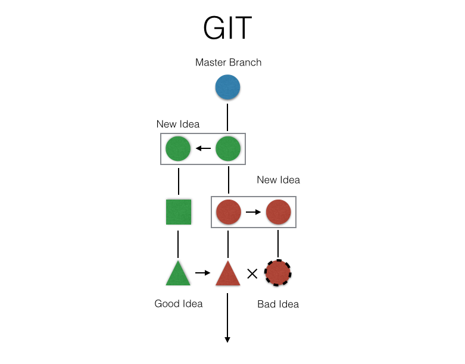
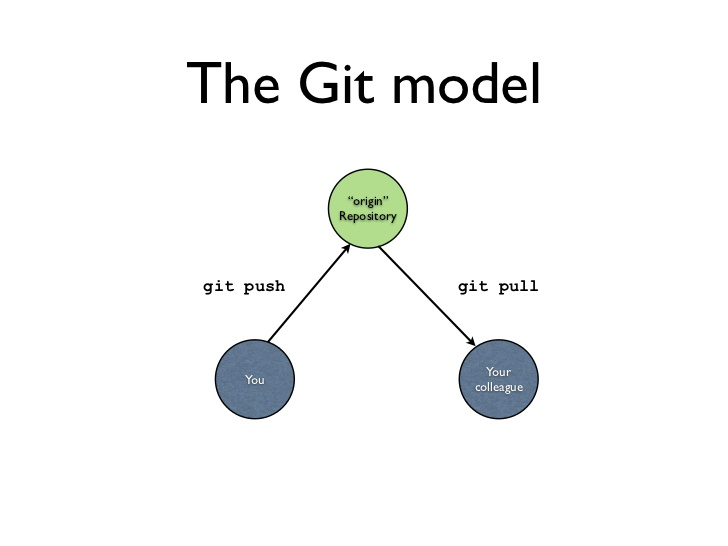

# Git

## Resources

* [Download Git](https://git-scm.com/downloads)
* [Resources to learn Git](https://try.github.io/)
* [Pull Request on Github: how-to](https://yangsu.github.io/pull-request-tutorial/)
